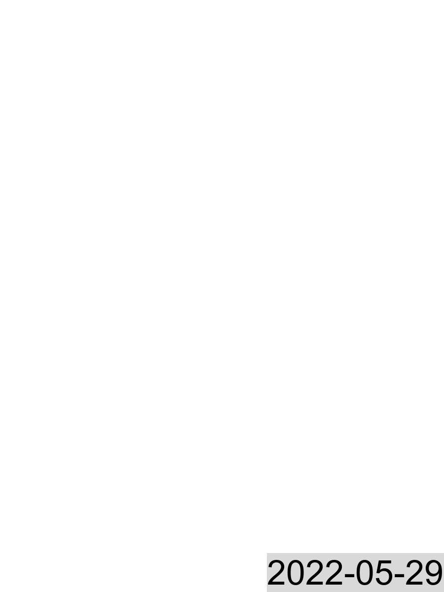

```{r setup, include = FALSE}
library(tidyverse)
library(plotly)
library(lubridate)
library(viridis)
library(scales)
library(mapboxapi)
library(leaflet)
library(highcharter)
library(tbl2xts)
knitr::opts_chunk$set(echo = FALSE)

this_hour <- Sys.time() %>% # find the current hour, for caching
             hour()

# Source the data processing script to bring in all the data
"lcbp_data_processor.r" %>%
  source()

```

Home
==================================================================

Home tabs {.tabset}
----------------------------------------------
### Welcome
####
This website shows real-time data from monitoring programs in Lake Champlain and throughout the Lake Champlain Basin.

Please choose a data type above. All data plots are interactive.

**This website is in development. All data is provisional and for educational purposes only.**

####
{width=100%}

### Info
####
Lake Champlain level, lake temperature, and tributary discharge data is collected by the [US Geological Survey](https://dashboard.waterdata.usgs.gov/). 

The Lamoille River and Malletts Bay buoys are part of a pilot study to upgrade and modernize the [Lake Champlain Long-term Monitoring Program](https://dec.vermont.gov/watershed/lakes-ponds/monitor/lake-champlain){target="_blank"}. These buoy are instrumented with an array of water quality and weather sensors that measure several parameters every 15 minutes. These buoys are supported by the [Lake Champlain Basin Program](http://lcbp.org){target="_blank"}, in partnership with New York and Vermont Departments of Environmental Conservation and SUNY Plattsburgh.

Satellite imagery is captured by the [NASA MODIS program](https://modis.gsfc.nasa.gov/about/){target="_blank"}, and images are retrieved from the [University of Wisconsin-Madison Space Science and Engineering Center](http://ge.ssec.wisc.edu/modis-today/){target="_blank"}.

This website was developed by [Matthew Vaughan](mailto:mvaughan@lcbp.org), Chief Scientist at the [Lake Champlain Basin Program](https://lcbp.org){target="_blank"}

**This site is in development. All data is provisional and for educational purposes only.** Reviewed and approved data will be available for download at the conclusion of each field season.

####
{width=50%}


Weather
=================================================================
```{r malletts_weather}
   malletts_xts <- malletts %>%
   rename(date = timestamp) %>%
   pivot_longer(-date,
                names_to = "var",
                values_to = "val") %>%
   tbl_xts(cols_to_xts = val,
           spread_by = var)

 malletts_weather_plot <-
   highchart(type = "stock") %>%
    hc_chart(zoomType = "x") %>%
    hc_yAxis_multiples(create_axis(naxis = 5, lineWidth = 2, title = list(text = NULL))) %>%
    hc_add_series(malletts_xts$air_temp_degC, 
                  name = "Air temperature (degC)",
                  yAxis = 0) %>%
    hc_add_series(malletts_xts$wind_speed_mps,
                  name = "Wind speed (mps)",
                  yAxis = 1) %>%
    hc_add_series(malletts_xts$wind_direction_deg,
            name = "Wind direction (deg from North)",
            yAxis = 2) %>%
    hc_add_series(malletts_xts$solar_radiation_Wm2,
                  name = "Solar radiation (W/m2)",
                  yAxis = 3) %>%
    hc_add_series (malletts_xts$rel_humidity_pct,
                   name = "Relative humidity (%)",
                   yAxis = 4) %>%
    hc_colors(viridis(5)) %>%
   hc_title(text = "Provisional weather data from the Malletts Bay monitoring buoy",
            align = "left") %>%
   hc_plotOptions(series = list(label = # label series
                           list(enabled = TRUE))) %>%
     hc_navigator(series = list(name = "")) # remove navigator series name so it's not labeled

 malletts_weather_plot

```

Lake level
==================================================================
```{r lake_level}
   lake_level_xts <- lake_level %>%
   select(timestamp, station, elevation_ft) %>%
   rename(date = timestamp) %>%
   mutate(station = station %>%
                    recode("Burlington, VT" = "burlington",
                           "Port Henry, NY" = "port_henry",
                           "North of Whitehall, NY" = "whitehall",
                           "Richelieu River at Rouses Point, NY" = "rouses_pt")) %>%
   tbl_xts(cols_to_xts = elevation_ft,
           spread_by = station)
   
  lake_level_plot <-
   highchart(type = "stock") %>%
    hc_chart(zoomType = "x") %>%
    hc_add_series(lake_level_xts$burlington, 
                  name = "Burlington, VT") %>%
    hc_add_series(lake_level_xts$port_henry,
                  name = "Port Henry, NY") %>%
    hc_add_series(lake_level_xts$whitehall,
              name = "North of Whitehall, NY") %>%
    hc_add_series(lake_level_xts$rouses_pt,
              name = "Richelieu River at Rouses Point, NY") %>%
    hc_colors(viridis(4)) %>%
    hc_title(text = "Lake Champlain surface elevation, in feet above sea level",
             align = "left") %>%
    hc_tooltip(valueDecimals = 1)
   
   lake_level_plot
  
```

Water temperature
==================================================================

Temp tabs {.tabset}
----------------------------------------------------------------

### USGS stations

```{r lake_temp}
# plot water temps in deg F
    lake_temp_xts <- lake_temp %>%
   select(timestamp, station, water_temp_degC, water_temp_degF) %>%
   rename(date = timestamp) %>%
   mutate(station = station %>%
                    recode("Burlington, VT" = "burlington",
                           "Port Henry, NY" = "port_henry",
                           "North of Whitehall, NY" = "whitehall",
                           "Richelieu River at Rouses Point, NY" = "rouses_pt")) %>%
   tbl_xts(cols_to_xts = water_temp_degF,
           spread_by = station)
   
  lake_temp_plot <-
   highchart(type = "stock") %>%
    hc_chart(zoomType = "x") %>%
    hc_add_series(lake_temp_xts$burlington, 
                  name = "Burlington, VT") %>%
    hc_add_series(lake_temp_xts$port_henry,
                  name = "Port Henry, NY") %>%
    hc_add_series(lake_temp_xts$rouses_pt,
              name = "Richelieu River at Rouses Point, NY") %>%
    hc_colors(viridis(3)) %>%
    hc_title(text = "Lake Champlain water temperature data from USGS stations, in degrees F",
             align = "left") %>%
    hc_tooltip(valueDecimals = 1)
   
   lake_temp_plot
 

```

### Malletts Bay
```{r malletts_temp}
malletts_watertemp <- malletts %>%
 select(c(timestamp, starts_with("temp"))) %>% # select only timestamp and temperature columns
 select(-temp_degC) %>% # remove the one from the EXO
 pivot_longer(-timestamp,
              names_to = "var",
              values_to = "degC") %>%
 mutate(depth_m = var %>% # find the water depth
                  substr(6, 7) %>% # pull the number out of the name
                  as.numeric(), # convert to numeric
        depth_ft = depth_m * 3.28084, # convert to ft
        degF = degC %>% # create column for Fahrenheit
               celsius.to.fahrenheit())

timestamp_labeller <- function(x){
  as.POSIXct(x, origin = '1970-01-01')
}

malletts_watertemp_plot2 <- malletts_watertemp %>%
  ggplot() +
  geom_tile(aes(x = timestamp,
                y = depth_ft,
                fill = degF)) +
  scale_fill_viridis("Temperature\n(deg F)",
                     option = "plasma") +
  scale_y_reverse() +
  labs(x = "",
       y = "Depth below water surface (ft)") +
  theme(text = element_text(face = "bold",
                            size = 12)) +
  labs(title = "Provisional water temperature profile data\nfrom the Malletts Bay monitoring buoy")

ggplotly(malletts_watertemp_plot2)

# tried and failed to make a highchart here.

# malletts_watertemp_xts <- malletts_watertemp %>%
# select(c(timestamp, depth_m, degF)) %>%
# rename(date = timestamp) %>%
# pivot_longer(-date,
#              names_to = "var",
#              values_to = "val") %>%
# tbl_xts(cols_to_xts = val,
#         spread_by = var)
# 
# malletts_watertemp_plot <- malletts_watertemp %>%
#   hchart(type = "heatmap",
#          hcaes(x = timestamp,
#                y = depth_m,
#                value = degF),
#                zoomType = "xy") %>%
#   hc_yAxis(reversed = TRUE,
#            title = "Depth (m)") %>%
#   # hc_xAxis(title = "",
#   #          scrollbar(enabeled = TRUE)) %>%
#   hc_colorAxis(stops = color_stops(20, plasma(20, direction = -1)))
# 
# malletts_watertemp_plot

```


Water quality
==================================================================

Plots {.tabset}
-------------------------------------------------------------------

### Lamoille River

```{r lamoille}
   lamoille_xts <- lamoille %>%
   rename(date = timestamp) %>%
   pivot_longer(-date,
                names_to = "var",
                values_to = "val") %>%
   tbl_xts(cols_to_xts = val,
           spread_by = var)
  
   lamoille_wq_plot <- # will add pH back in when it's replaced.
   highchart(type = "stock") %>%
    hc_chart(zoomType = "x") %>%
    hc_yAxis_multiples(create_axis(naxis = 5, lineWidth = 2, title = list(text = NULL))) %>%
    hc_add_series(lamoille_xts$temp_degC, 
                  name = "Water temperature at sensor (degC)",
                  yAxis = 0) %>%
    hc_add_series(lamoille_xts$sp_cond_uScm,
                  name = "Specific conductivity (uS/cm)",
                  yAxis = 1) %>%
    hc_add_series(lamoille_xts$odo_pct_sat,
                  name = "Dissolved oxygen (% saturated)",
                  yAxis = 2) %>%
    hc_add_series (lamoille_xts$turb_fnu,
                   name = "Turbidity (FNU)",
                   yAxis = 3) %>%
     hc_add_series (lamoille_xts$nitrate_mgL,
               name = "Nitrate-N (mg/L)",
               yAxis = 4) %>%
    hc_colors(plasma(5)) %>%
    hc_title(text = "Provisional water quality data from the Lamoille River monitoring buoy",
             align = "left") %>%
    hc_tooltip(valueDecimals = 1) %>%
   hc_plotOptions(series = list(label =  # label the series
                           list(enabled = TRUE))) %>%
     hc_navigator(series = list(name = "")) # remove the navigator series name so it's not labeled
   
   lamoille_wq_plot
   

```

### Malletts Bay

```{r malletts_wq}
   malletts_wq_plot <-
   highchart(type = "stock") %>%
    hc_chart(zoomType = "x") %>%
    hc_yAxis_multiples(create_axis(naxis = 7, lineWidth = 2, title = list(text = NULL))) %>%
    hc_add_series(malletts_xts$temp_degC, 
                  name = "Water temperature at sensor (degC)",
                  yAxis = 0) %>%
    hc_add_series(malletts_xts$sp_cond_uScm,
                  name = "Specific conductivity (uS/cm)",
                  yAxis = 1) %>%
    hc_add_series(malletts_xts$pH,
            name = "pH",
            yAxis = 2) %>%
    hc_add_series(malletts_xts$odo_pct_sat,
                  name = "Dissolved oxygen (% saturated)",
                  yAxis = 3) %>%
    hc_add_series (malletts_xts$turb_fnu,
                   name = "Turbidity (FNU)",
                   yAxis = 4) %>%
     hc_add_series (malletts_xts$chlorophyll_rfu,
               name = "Chlorophyll (RFU)",
               yAxis = 5) %>%
     hc_add_series (malletts_xts$phycocyanin_rfu,
               name = "Phycocyanin (RFU)",
               yAxis = 5) %>%
     hc_add_series (malletts_xts$nitrate_mgL,
               name = "Nitrate-N (mg/L)",
               yAxis = 6) %>%
    hc_colors(plasma(8)) %>%
    hc_title(text = "Provisional water quality data from the Malletts Bay monitoring buoy",
             align = "left") %>%
    hc_tooltip(valueDecimals = 1) %>%
   hc_plotOptions(series = list(label = # label the series
                           list(enabled = TRUE))) %>%
     hc_navigator(series = list(name = "")) # remove the navigator series name so it's not labeled
   
   malletts_wq_plot
```


### Valcour

The Valcour buoy will be deployed in spring 2022. 

### Upper Saranac Lake

Data from the Upper Saranac Lake Environmental Monitoring Platform can be found [at this website](https://adkwatershed.shinyapps.io/UpperSaranacLake/){target="_blank"}, hosted by the Paul Smith's College Adirondack Watershed Institute. 

### Lake Carmi

Data from the Lake Carmi water quality monitoring platform can be found [at this website](http://epscor.uvm.edu/LakeCarmi/){target="_blank"}, hosted by the University of Vermont and Vermont Department of Environmental Conservation. 


Tributary flow
==================================================================

Flow tabs {.tabset}
----------------------------------------------------------------

### Tributary discharge

```{r tribq}
  tribq_xts <- tribq %>%
   select(timestamp, trib, discharge_cfs) %>%
   rename(date = timestamp) %>%
   tbl_xts(cols_to_xts = discharge_cfs,
           spread_by = trib)
   
  tribq_plot <-
   highchart(type = "stock") %>%
    hc_chart(zoomType = "xy") %>%
    hc_add_series(tribq_xts$Winooski,
                  name = "Winooski") %>%
    hc_add_series(tribq_xts$Missisquoi,
                  name = "Missisquoi") %>%
    hc_add_series(tribq_xts$Lamoille,
                  name = "Lamoille") %>%
    hc_add_series(tribq_xts$Otter,
                  name = "Otter") %>%
    hc_add_series(tribq_xts$Saranac,
                  name = "Saranac") %>%
    hc_add_series(tribq_xts$Ausable,
                  name = "Ausable") %>%
    hc_add_series(tribq_xts$Boquet,
                  name = "Boquet") %>%
    hc_add_series(tribq_xts$Great.Chazy, 
                  name = "Great Chazy") %>%
    hc_add_series(tribq_xts$Poultney,
                  name = "Poultney") %>%
    hc_add_series(tribq_xts$Mettawee,
                  name = "Mettawee") %>%
    hc_add_series(tribq_xts$New.Haven,
                  name = "New Haven") %>%
    hc_add_series(tribq_xts$Lewis,
                  name = "Lewis") %>%
    hc_add_series(tribq_xts$Little.Ausable,
                  name = "Little Ausable") %>%
    hc_add_series(tribq_xts$Salmon,
                  name = "Salmon") %>%
    hc_add_series(tribq_xts$Little.Otter,
                  name = "Little Otter") %>%
    hc_add_series(tribq_xts$Little.Chazy,
                  name = "Little Chazy") %>%
    hc_add_series(tribq_xts$LaPlatte,
                  name = "LaPlatte") %>%
    hc_add_series(tribq_xts$Mill,
                  name = "Mill") %>%
    hc_add_series(tribq_xts$Jewett,
                  name = "Jewett") %>%
    hc_tooltip(split = FALSE,
               shared = TRUE,
               sort = TRUE) %>%
    hc_colors(magma(19)) %>%
    hc_title(text = "Lake Champlain tributary discharge data from USGS, in cubic feet per second",
             align = "left") %>%
    hc_tooltip(valueDecimals = 1)
   
   tribq_plot

   
```

### Total discharge
```{r total_q}
# Sum discharges together by timestamp
combined_q <- tribq %>%
  select(!c(trib, gage_number)) %>%
  group_by(timestamp) %>%
  summarise(total_discharge_cms = sum(discharge_cms),
            total_discharge_cfs = sum(discharge_cfs),
            n = n()) %>%
  filter(!n < max(n)) # remove timestamps that don't include all tribs
 
combined_q_xts <- combined_q %>%
   select(timestamp, total_discharge_cfs) %>%
   rename(date = timestamp) %>%
   tbl_xts()

n_combined_tribs <- combined_q %>%
           pull("n") %>%
           max()

  combined_q_plot <- # will add pH back in when it's replaced.
   highchart(type = "stock") %>%
    hc_chart(zoomType = "x") %>%
   hc_add_series(combined_q_xts$total_discharge_cfs, 
                  name = "Total measured discharge to Lake Champlain (cfs)") %>%
   hc_colors(plasma(1)) %>%
    hc_title(text = paste0("Total measured discharge from ",
                          n_combined_tribs,
                          " tributaries to Lake Champlain, in cubic feet per second"),
             align = "left") %>%
    hc_subtitle(text = "Note that several tributaries and direct-to-lake sources of water that are not monitored and/or not included in this plot",
                align = "left") %>%
    hc_tooltip(valueDecimals = 1)
  
   combined_q_plot
```


### Map of gauging stations

```{r trib_map}
# define buoy location
station_loc <- "data/trib_station_info.csv" %>%
                 read_csv()

# subbasins_poly <- "data/lcb_subbasin_shapefile/LCB_2013_subbasins.shp" %>%
#                   st_read()
# create the map
station_loc %>%
  leaflet() %>%
  addProviderTiles("Esri.WorldImagery") %>%
  # addPolygons(data = subbasins_poly) %>%
  addMarkers(lng = ~lng,
             lat = ~lat,
             label = ~trib)

```


Imagery
==============================================================================

Note that satellite images may be obscured by cloud cover or processing errors.

Images {.tabset}
-------------------------------------------------------------------------

### Yesterday (`r Sys.Date() - 1`)



### Past week (`r Sys.Date() - 8` through `r Sys.Date() - 1`)

